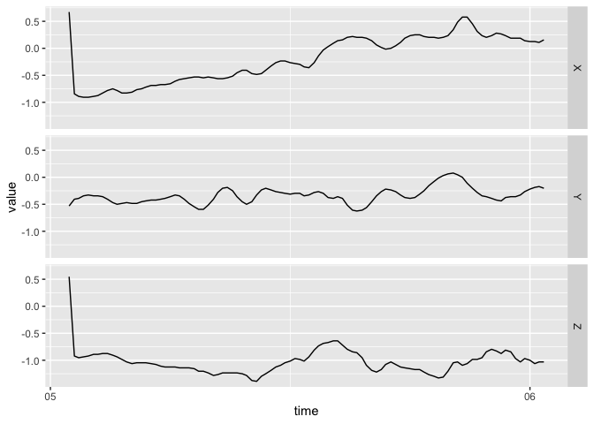

<!-- README.md is generated from README.Rmd. Please edit that file -->

# bis620.2022

<!-- badges: start -->

[](https://github.com/paulzrq/BIS-620/actions/workflows/lint.yaml)
[](https://github.com/paulzrq/BIS-620/actions/workflows/test-coverage.yaml)
[](https://github.com/paulzrq/BIS-620/actions/workflows/R-CMD-check.yaml)
[](https://app.codecov.io/gh/paulzrq/bis620.2022)
<!-- badges: end -->

The goal of bis620.2022 is to plot time series data, including basic
plot and spectral calculation. The data must contains ‘time’ and ‘freq’
column

## Installation

You can install the development version of bis620.2022 from
[GitHub](https://github.com/) with:

``` r
# install.packages("devtools")
devtools::install_github("paulzrq/BIS-620")
```

## Example

This is a basic example which shows you how to solve a common problem:

``` r
library(bis620.2022)

data(ukb_accel)

accel_plot(ukb_accel[1:100, ])
```



``` r
## basic example code
```
